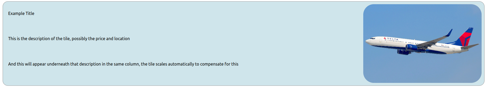

# How to use Tiles

---

## Attributes and Properties

_Tiles are dependant on four properties. These are the attributes:_

### title

### src

### href

_AND the contained children of the &lt;Tile&gt;Child tags in here&lt;/Tile&gt;_

---

The title adjusts the content inside of the h3 header tag at the top left of the tile (as well as the alt attribute for the image)

The src adjusts the src attribute for the image which is automatically styled to be a cover on the right hand side of the tile

The href is the link that the tile will point to when clicked

All other children are put into the tile content on the left hand side of the tile underneath the title. This is styled in a (0.75/1)fr-grid meaning that each child at the first level down will be placed into the column underneath the heading.

---

## Example

```html
<Tile title="Example Title" src="./Images/myImage.jpg" href="/flight/q=17">
	<p>This is the description of the tile, possibly the price and location</p>
	<p>
		And this will appear underneath that description in the same column, the
		tile scales automatically to compensate for this
	</p>
</Tile>
```


